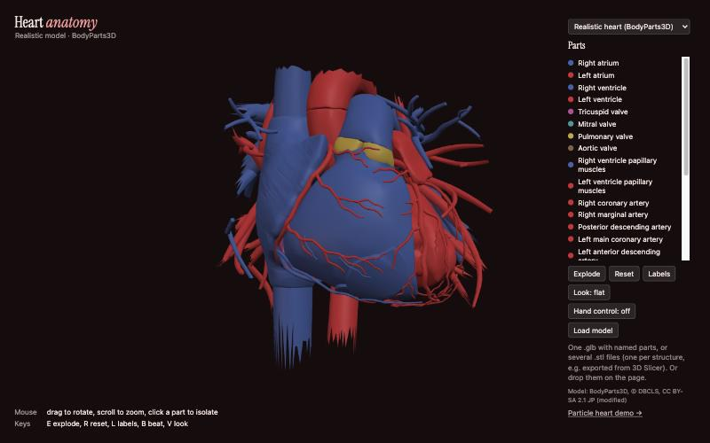
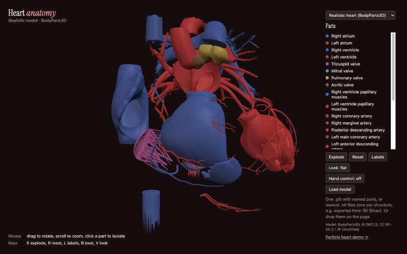
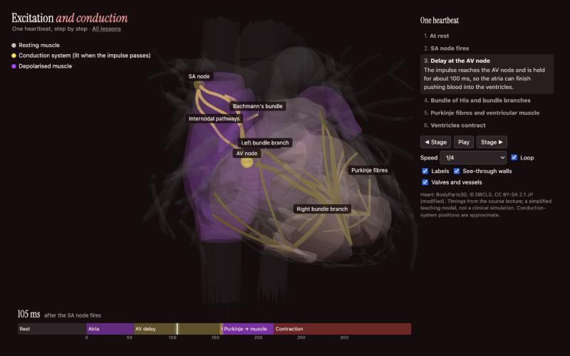

# Overview

I am building webcam hand-tracking tools that run in a web browser to explore how visual aid and interactive motion can aid in learning or potential rehabilitation. During my Duke years, I have taken a few phisology and biology classes, and thought it would be cool to enhance the potential for learning by making the anatomy 3d. Eventually, I'd want to build this out further for med-students or even doctors to see and interact with body parts in 3D. I am exploring two avenues on this codebase: 

- **Heart anatomy and physiology**: a 3D heart built from real anatomy data
  that you can turn, take apart and label, with your hands through the
  webcam or with the mouse, and a lesson that follows one
  heartbeat through the heart's conduction system. All the anatomy is built from BodyParts3D, a free 3D anatomy database made by Database Center for Life Science in Japan. 
  - **Hand games**: gesture games for one or two people on one webcam. They
  give people with Parkinson's a playful way to practise hand movements
  such as pinching, lifting, stirring and chopping.

### [Try it in your browser →](https://ellabellae.github.io/interactivegames/)

A working site, not a video. No install needed. Everything is in **3D**: turn
the heart, zoom in, take it apart and look inside.

**Use your webcam and your hands, or the mouse.**

| | **Your hands, through the webcam** | **Mouse or trackpad** |
|---|---|---|
| Turn it in 3D | open hand and move it | drag |
| Grab a part and pull it out | pinch it, move, let go | press E to take everything apart |
| Zoom | move two hands apart or together | scroll |
| Pick out one part | — | click it, or its name in the list |

In the heart viewer, click **✋ Use webcam** and allow the camera.
Hand tracking runs inside your browser, and the video never leaves your
computer. The games use the webcam too: two people can play side by side on
one camera. The demo below was recorded with the mouse.


| A real heart, not a cartoon: chambers, valves, coronary arteries and great vessels | Take it apart to see the valves and chambers | Follow one heartbeat in slow motion, with the lecture's timings |
|---|---|---|
|  |  |  |

## Not a medical device

This is movement practice and a study aid. It is **not a medical device**.
It does not diagnose, treat, monitor or measure any condition, and it is not
a substitute for advice from a doctor, physiotherapist or occupational
therapist. The times and counts in the games are for noticing change over
time and adjusting the game settings, not a measure of health.

## What's in it

### Heart anatomy (`apps/anatomy`)

- **A realistic heart** built from BodyParts3D, a 3D anatomy database made
  from a scanned adult body. It has 26 labelled, separable parts:
  - the four chambers
  - all four valves
  - papillary muscles
  - coronary arteries by branch
  - the coronary sinus and cardiac veins
  - the great vessels

  Vessels are coloured by oxygenation. See
  `apps/anatomy/models/bodyparts3d-heart/` for its source and licence.
- **The original schematic heart** is still available from the model menu.
- **Load your own model:** one `.glb` file with named parts, or several
  `.stl` files, one per structure (for example exported from 3D Slicer).
  Use the "Load model" button or drop the files on the page.
- Two looks: hologram and flat.
- Controls:
  - **Hands, through the webcam** (click "✋ Use webcam" first; it's
    off by default): open
    hand to rotate; pinch a part to grab and move it; two hands apart to
    zoom.
  - **Mouse:** drag to rotate, scroll to zoom, click a part (or its name in
    the list) to show only that part.
  - **Keys:** E explode, R reset, L labels, B heartbeat, V look.
- A separate particle-heart demo page.

### Physiology lessons (`apps/physiology`)

- **Excitation and conduction:** follows one heartbeat through the realistic
  heart, step by step:
  - the SA node fires and the wave crosses the atria
  - the AV node holds the impulse for about 100 ms
  - the bundle of His, bundle branches and Purkinje fibres carry it on
  - the ventricles depolarise and contract
- **Controls:** play, pause, step, slow motion (1/10 speed) and a
  millisecond timeline you can drag.
- **Where the timings come from:** the course lecture, with slide numbers
  recorded in `apps/physiology/src/conduction-model.js`. The one value not
  from the lecture is labelled there.
- **Conduction-system positions are approximate.** BodyParts3D doesn't
  include the conduction system, so it is placed by rules from nearby
  anatomy, written out in `scripts/compute-conduction-landmarks.mjs`.
- This is a simplified teaching model, not a clinical simulation.

### Hand games (`apps/games`)

- **Kitchen:** cook a recipe step by step (pinch and drop, stir, chop,
  shake, carry, flip). A "Bing!" plays on every completed step.
- **Bricks:** copy a picture brick by brick. A "Bing!" plays on every
  correct brick.
- **Modes:**
  - **Race:** two people, one on each half of the screen.
  - **Co-op** (Bricks only): two people build one board together, for
    example a player and a therapist or family member.
  - **Solo:** one person, any hand, against their own best time. You can't
    lose.
- **Profiles:**
  - **Standard:** the games as designed.
  - **Gentle:** for reduced range of motion, slower movement or tremor.
    Bigger targets, smaller movements count, a steadier cursor, fewer
    repetitions, a slow lift instead of a fast flick, calm music, and no
    sound on a wrong drop.

  Choose on the games menu or inside each game. The choice is remembered.
- **Progress page:** a list of past sessions on this device (steps, times,
  counts, which profile was used), with export to CSV. There's an optional
  "Who's playing?" label for a shared device.
- The mouse or touch screen works everywhere, so you can test without a
  camera or a second person.

## Privacy

- **The camera image never leaves your computer.** Hand tracking runs
  inside the browser (Google's MediaPipe), and no video or images are sent
  anywhere.
- **Progress data, the profile choice and the player label** are stored
  only in this browser on this device. There are no accounts and no server.
  Clearing the browser's site data deletes them. Use "Export CSV" to keep a
  copy.
- **The pages do download some files from the internet when they open:**
  - three.js and MediaPipe from the jsDelivr CDN
  - the hand-tracking model from Google's storage
  - fonts from Google Fonts

  These are ordinary file downloads, and nothing you do in the app is sent
  with them. It also means **an internet connection is needed**.

## What you need

- **Google Chrome on a desktop or laptop.** Other browsers haven't been
  tested.
- **A webcam.** The built-in laptop camera is fine.
- **An internet connection** (see Privacy).

## Setting up for two players (games)

- Sit or stand side by side, facing the screen, one person on each half.
  The line down the middle of the screen is the boundary.
- Hand tracking follows **two hands in total**. Each player should use one
  hand and keep their other hand down, out of view.
- Put the camera at about chest height, centred between the two players,
  about 1 to 1.5 m (3 to 5 ft) away, so both hands are visible without
  reaching.
- Light your hands from the front, and avoid a bright window behind you. A
  plain background helps.
- A pinch is thumb tip to index-finger tip. The ring under your cursor fills
  in when a pinch is registered.
- In **Co-op**, both players can work anywhere on the one board.
- In **Solo**, either hand works.

## Running it locally

You need [Node.js](https://nodejs.org/) 24 or newer.

```bash
npm install
```

**Development servers,** which reload as you edit:

```bash
npm run dev:games
```

```bash
npm run dev:anatomy
```

Each one prints a local address, such as `http://localhost:5173/`. Open that
address in Chrome.

**Build the finished pages:**

```bash
npm run build
```

This writes every page to `dist/` as a single self-contained HTML file:
`dist/index.html`, `dist/anatomy/…`, `dist/games/…`.

### Opening the pages as files

You can open the built files directly, with no server. For example,
double-click `dist/games/index.html`. Things to know:

- **Use Chrome.** Other browsers may block the camera or other features for
  local files.
- **Chrome asks for camera permission for local files,** and may ask again
  each time.
- **Saved data is kept separately for each address.** The local files and
  a website copy (for example on GitHub Pages) each keep their own profile
  choice and progress log. One can't see the other's.
- **The internet is still needed** for the CDN files and the hand model.

Always run `npm run build` first. The source `.html` files in `apps/` need
the dev server and won't work when opened directly.

## Deploying to GitHub Pages

The site is published automatically. Every push to `main` runs the tests,
type check and build (`.github/workflows/pages.yml`), then publishes `dist/`
to GitHub Pages. If any check fails, nothing is published, and the site
keeps its last working version.

**Live site:** https://ellabellae.github.io/interactivegames/

**One-time setup** on github.com:

1. The repository must be **public**. GitHub Pages is free only for
   public repositories.
2. In **Settings → Pages → Build and deployment**, set **Source** to
   **GitHub Actions**.

**To deploy a change,** merge it into `main` and push:

```bash
git switch main
```

```bash
git merge --no-ff <your-branch>
```

```bash
git push origin main
```

Then watch it in the repository's **Actions** tab. It takes a minute or two.
You can also re-run a deploy by hand from the Actions tab ("Run workflow").

Other branches are checked by `.github/workflows/ci.yml` (tests, type check,
build) but never published.

### Starting from scratch (a new copy of the repository)

Create an **empty public** repository on github.com, without a README,
licence or .gitignore, then:

```bash
git remote add origin https://github.com/<you>/<repo>.git
```

```bash
git push -u origin --all
```

Then set **Settings → Pages → Source** to **GitHub Actions**. The site
appears at `https://<you>.github.io/<repo>/`. The pages use relative links,
so they work under any repository name.

## Tuning the settings

Every threshold that makes a gesture easier or harder is in one settings
object, in `packages/core/src/settings.js`:
- pinch distance
- cursor smoothing
- target sizes
- chop, shake, stir and lift amounts
- repetitions
- tempo

The **Standard** and **Gentle** profiles are defined there, and each value
has a comment saying what it controls. Gentle's values are starting points,
meant to be adjusted using the Progress logs. The CSV records the exact
values that were in effect for every session.

## Project layout

```
packages/core/       shared code: settings and profiles, gesture detection,
                     hand tracking, player slots, sound, progress log
apps/anatomy/        heart viewer, realistic heart model, particle demo
apps/physiology/     physiology lessons (conduction)
apps/games/          games menu, Kitchen, Bricks, Progress page
site/index.html      home page linking the apps
scripts/build.mjs    builds every page into dist/
legacy/              the original single-file prototypes, unchanged, for reference
```

## Development

```bash
npm test
```

Runs the unit tests (Vitest). The gesture detectors are tested against
recorded and synthetic hand paths, including a copy of the original
prototype code.

```bash
npm run check
```

Runs type checking (TypeScript, on plain JavaScript; opt-in per file with
`// @ts-check`).

Work happens on a branch per change, with commit messages that explain why
(Conventional Commits). Branches are merged into `main` with `--no-ff`.

## Credits and licences

- [three.js](https://threejs.org/) (MIT) for 3D.
- [MediaPipe](https://developers.google.com/mediapipe) Hand Landmarker
  (Apache 2.0) for hand tracking.
- The Fredoka and Instrument Serif fonts (SIL Open Font License) via Google
  Fonts.
- The versions of three.js and MediaPipe are pinned in
  `packages/core/src/cdn.js`.

This project's code is released under the [MIT License](LICENSE): anyone
may use, copy, change and share it, as long as the copyright and licence
notice are kept. It is provided as is, without warranty. Files that come
from other sources (for example 3D models) keep their own licence, noted in
a LICENSE or README next to them.
